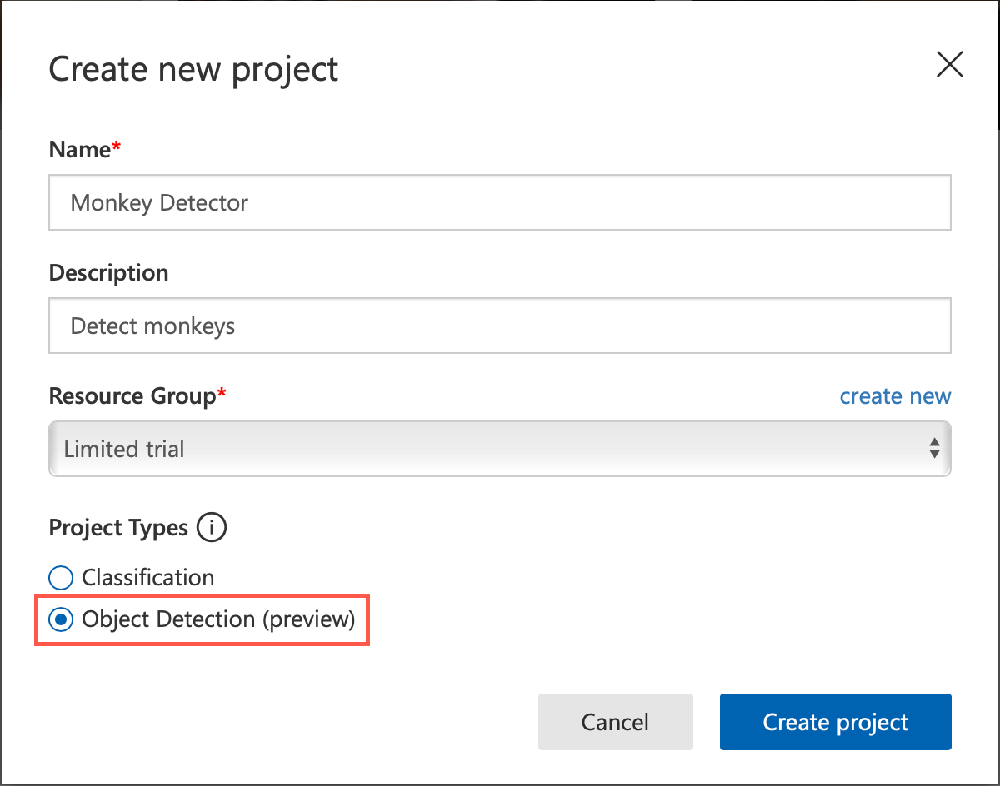
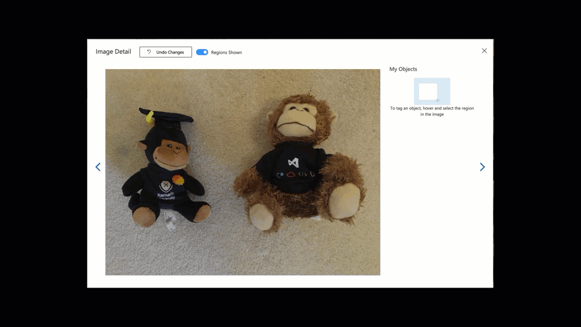
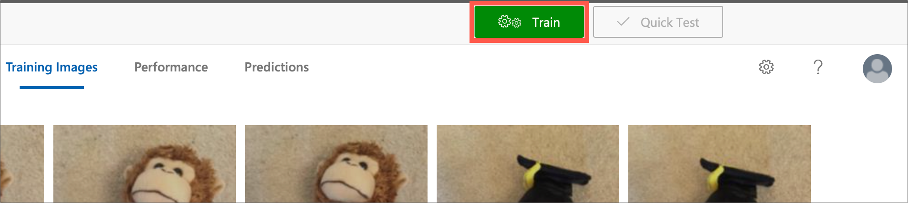
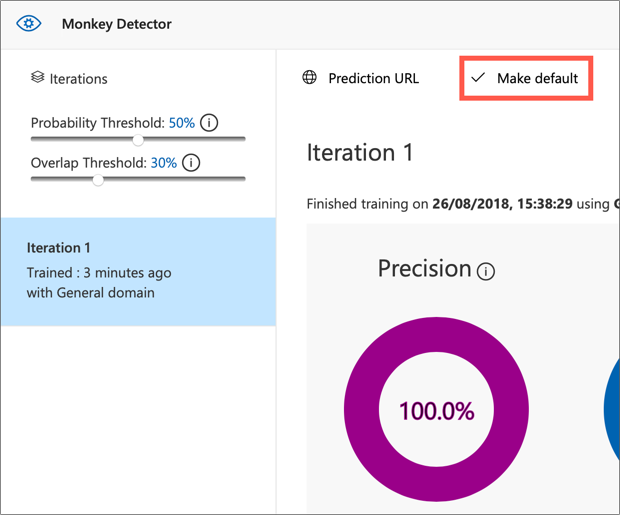
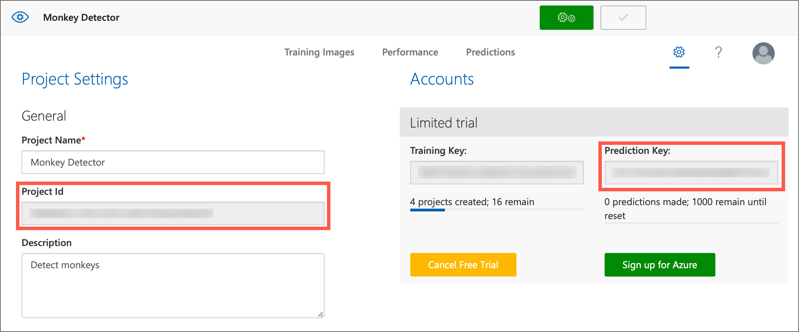
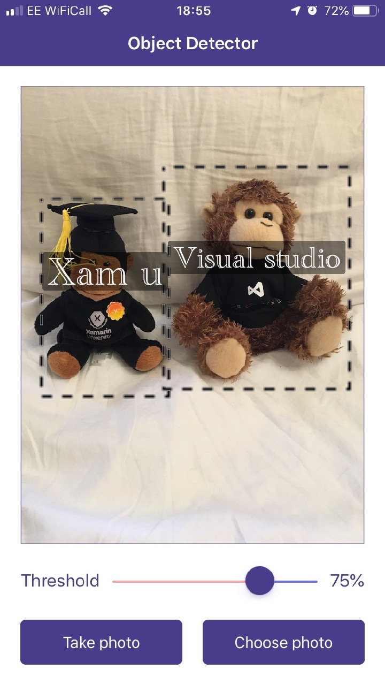

# Using Custom Vision to detect toys with your phone

Microsoft Cognitive Services provide a great way to get started with AI without being a machine learning or data science expert. One of my favorite cognitive services is the [Custom Vision Service](https://customvision.ai/?WT.mc_id=objectdetection-xamarinblog-jabenn). The first version of this service allowed you to easily build an image classifier model that you could access either via a REST API (with an SDK available for Xamarin apps), or by downloading a model that can be run on your device using either CoreML, TensorFlow or WindowsML (we looked at using TensorFlow in an Android app in an [earlier blog post](https://blog.xamarin.com/android-apps-tensorflow/?WT.mc_id=objectdetection-xamarinblog-jabenn)).

At Microsoft Build 2018 a new feature was announced for this service that is currently available in preview - Object Detection. This allows you to train a model with different objects, then detect those objects in an image, including their position inside the image.

In this post, we'll use this feature to create a model that can identify different monkeys, and detect these in a photo taken with a cross-platform Xamarin.Forms app.

## Getting started

Just like with Image Classification, the Custom Vision service allows you to train Object Detection models using a small number of images. You will need at least 15 images of each monkey you want to detect, rather than the thousands you would need if you were building a model yourself from scratch.

Lets start by creating a project in the Custom Vision service. Head to [CustomVision.ai](https://customvision.ai/?WT.mc_id=objectdetection-xamarinblog-jabenn) and create a new project. Give it a name and description, and select the __Object Detection (Preview)__ project type.



You train an Object Detection model by uploading images containing the object you want to detect, mark out a bounding box on the image to indicate where the object is, then tag the object. This means that images can contain more than one object - in this case you add multiple bounding boxes.

Start by gathering image of monkeys, then click the __Add Images__ button and upload all your images.

Once all your images are uploaded, you need to tell the service where the monkeys are in each photo. Click on the first image and an __Image Detail__ panel will appear. Directly on the image, draw a bounding box around each monkey - making it as tight as possible to the monkey. After drawing a box you can drag the edges or corners to adjust the box if needed. Once you have drawn the bounding box, enter a tag name, or select one you've set before. In my case I have a Xamarin University monkey and a Visual Studio monkey, so I tagged them with `Xam U` and `Visual Studio` respectively.

After you have drawn bounding boxes and tagged all monkeys in the image, click the __Next__ arrow to move to the next image. Repeat this process with all your images.



Once you have drawn bounding boxes for all the monkeys, the __Next__ button will disappear, so close the __Image Detail__ popup. Click the green _+Train__ button at the top to train the model.



This will take a couple of minutes to run. Once done the first iteration of the model will be created. You can keep uploading images and re-training the model to create different iterations, then choose which iteration will be the default used when the service is called.

The first iteration is not made the default one automatically, so click the __Make Default__ button.



Finally, head to the __Settings__ tab in the Custom Vision portal. From this tab you can see your Prediction key used when calling the model to classify images or detect objects, a Training key that you can use to train your model from your app if required, and a Project Id for the current project. You will need your Prediction key and Project Id later, so note these down.



## Calling your model from a Xamarin App

Now that we have our model created, it's time to call it from inside a Xamarin app. All the Microsoft Cognitive Services are available over a REST API, and to make it even easier to call from any .NET app there are NuGet packages available that work on all platforms including iOS and Android.

### Adding the NuGet package

From your Xamarin.Forms app, add the [__Microsoft.Azure.CognitiveServices.Vision.CustomVision.Prediction__](https://www.nuget.org/packages/Microsoft.Azure.CognitiveServices.Vision.CustomVision.Prediction) NuGet package. This package is currently in preview, so remember to tick the __Include prerelease__ option.

Add this package to all projects in your app.

### Configuring the Prediction endpoint

To use the Custom Vision service to analyse an image, you first need to create a `PredictionEndpoint`, configured with your Prediction key.

```cs
var endpoint = new PredictionEndpoint
{
    ApiKey = <Your Prediction Key>
};
```

## Detecting objects

To detect objects, first you need an image captured from somewhere. To use the camera, I’d recommend using the [Xam.Plugin.Media NuGet package](https://www.nuget.org/packages/Xam.Plugin.Media/). This package has helpers to open the camera and extract the photo taken by the user.

### Detecting objects in an image

To detect objects, get the image as a stream, then pass it to a call to `DetectAsync` on the prediction endpoint.

```cs
var options = new StoreCameraMediaOptions();
var photo = CrossMedia.Current.TakePhotoAsync(options)
var results = await endpoint.PredictImageAsync(<Your Project Id>,
                                               photo.GetStream());
```

You will need to pass in the Project Id as a `Guid`. This will upload your photo to the custom vision service, your model will be run to detect as many objects as possible, then the results returned to the app.

> If this call throws an HTTP exception with the status of "Not Found", then make sure you have marked the first iteration of the model as default.

If you have used the Image Classification features of the Custom Vision Service before then you may recognize this call - it is the same call you would have made to classify the image. The only difference is the results.

### Handling the results

The `DetectAsync` call will return a `List<PredictionModel>`, with one item in the list for each object that is detected in the image. These models contain a number of fields of interest:

* `TagName` - the name of the tag for the detected object.
* `BoundingBox` - the location in the image of the object. The coordinates of the box are percentages of the size of the image, represented as doubles from 0 to 1. For example you might have a bounding box with the following parameters for an image that is 640x720 pixels in size:
  
  * Left: 0.1
  * Top: 0.3
  * Width: 0.4
  * Height: 0.5

  The top left coordinate of the object would be at 64x216 (10% of 640 by 30% of 720). The box will be 256 pixels wide (40% of 640) by 360 (50% of 720).

* `Probability` - the probability that the object in the bounding box is the tagged object. This is a double from 0-1, with 0 being 0% and 1 being 100%.

As well as the objects you are expecting, you will also get a few extra objects detected with low probabilities, this is fairly normal for these models. You can filter these out by filtering all objects detected below a certain percentage threshold, for example filter out everything lower than 75%.



## See this in action on the Xamarin Show

I also discussed this in a recent Xamarin Show on Channel9.

<!-- Xamarin Show link goes in here -->

## Conclusion

It's easy to detect objects in an image using the Object Detection models in the Custom Vision service. You can find the source code for an app that will take a photo, detect objects using a custom vision model, and show the detected objects on my [GitHub](https://github.com/jimbobbennett/ObjectDetector). Check out our documentation [here](https://aka.ms/XamObjectDetection) to learn more.